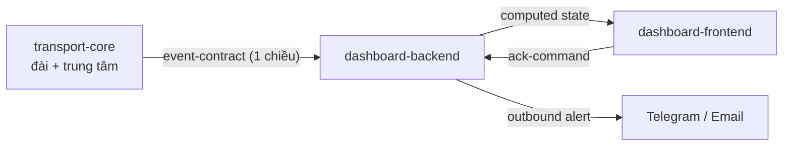
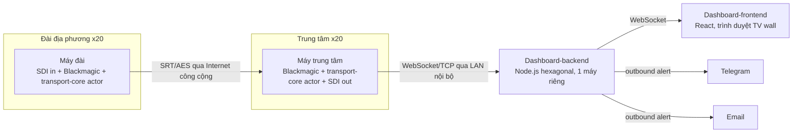

# Architecture Spine — SRT Transport & Monitoring VTCDigital

## Design Paradigm

**Event-driven actor-per-channel edges + hexagonal central aggregator.**

- **Edge (20 máy đài + 20 máy trung tâm)**: mỗi kênh là 1 actor độc lập với state machine riêng (`CONNECTING`/`CONNECTED`/`RECONNECTING`/`REJECTED`), không chia sẻ state với actor khác. Namespace: `transport-core/`.
- **Center-aggregator (dashboard-backend)**: hexagonal ports & adapters — lõi nghiệp vụ thuần (debounce/threshold/cooldown/state) tách biệt khỏi adapter ingest (WebSocket/TCP từ 20 máy trung tâm) và adapter outbound (Telegram/Email/WebSocket→React). Namespace: `dashboard-backend/`.
- **Presentation**: render thuần trạng thái đã tính sẵn, không tự suy luận state. Namespace: `dashboard-frontend/`.
- Toàn hệ thống nối 2 lớp bằng EDA, telemetry một chiều actor→aggregator, không polling.

## Invariants & Rules

### AD-1 — Transport điểm-điểm tự build trên libsrt

- **Binds:** FR-1
- **Prevents:** Chia sẻ state/kết nối giữa các kênh; phụ thuộc SLA/roadmap/tính năng đóng gói của appliance/SDK thương mại bên thứ ba.
- **Rule:** Mỗi kênh có đúng 1 kết nối SRT độc lập, dựa trên thư viện mã nguồn mở libsrt (Haivision/srt) + lớp orchestration tự build riêng — KHÔNG dùng appliance/SDK thương mại đóng gói sẵn (Haivision SRT Gateway/StreamHub, Zixi...). Không có state dùng chung giữa kết nối của các kênh. (Lưu ý thuật ngữ: libsrt bản thân đã là thư viện mở do Haivision khởi xướng — ranh giới "tự build" nằm ở lớp orchestration và việc không dùng appliance thương mại, không phải tránh chính libsrt.)

### AD-2 — Cách ly lỗi ở mức máy vật lý [ADOPTED]

- **Binds:** FR-1, FR-4
- **Prevents:** Một kênh chiếm tài nguyên/crash làm mất giám sát hoặc luồng của các kênh khác (phương án process-isolation trên 1 máy trung tâm chung đã bị thay thế vì DeckLink Studio 4K chỉ có 1 SDI in/out mỗi card).
- **Rule:** Trung tâm gồm 20 máy vật lý riêng biệt, đối xứng 1:1 với 20 máy tại đài; mỗi máy trung tâm nhận đúng 1 kênh qua đúng 1 card DeckLink Studio 4K. Không gộp nhiều kênh trung tâm vào chung một máy vật lý trong MVP#1.

### AD-3 — OS = Windows cho toàn bộ transport-core [ADOPTED] (resolves OQ-1)

- **Binds:** FR-1, FR-4
- **Prevents:** Trộn lẫn Linux/Windows gây khác driver Blackmagic và khác cơ chế supervisor.
- **Rule:** Toàn bộ 20 máy đài + 20 máy trung tâm chạy Windows, dùng Blackmagic Desktop Video driver for Windows; tiến trình transport-core chạy dưới dạng Windows Service với auto-restart (không dùng systemd).

### AD-4 — Ngôn ngữ transport-core = C++ [AMENDED 2026-08-31]

- **Binds:** FR-1, FR-2, FR-4, FR-5
- **Prevents:** Thêm lớp FFI/subprocess trung gian giữa ứng dụng và libsrt C API / capture-encode API (không gọi CLI `ffmpeg` làm tiến trình con, không binding qua ngôn ngữ khác).
- **Rule:** Toàn bộ transport-core viết bằng C++, 1 tiến trình/kênh (không đổi so với bản gốc). Với libsrt: gọi trực tiếp API C. Với capture/output Blackmagic và encode H.264: **link trực tiếp thư viện FFmpeg (`libavformat`/`libavcodec`/`libavdevice`) vào trong tiến trình C++**, gọi như một native C API — KHÔNG shell-out CLI `ffmpeg` làm subprocess. Lý do amend: team hiện chưa có kinh nghiệm Blackmagic SDK, tự viết capture/encode pipeline từ đầu là rủi ro triển khai lớn (phát hiện 2026-08-31); `libavdevice` đã có sẵn module decklink capture/output đã kiểm chứng, giảm đúng phần khó nhất mà không vi phạm lý do gốc của AD-4 (tránh FFI/subprocess — libav* là thư viện C native, gọi trong cùng tiến trình giống hệt cách gọi libsrt hiện tại, không phải một tầng FFI mới). Vòng lặp ABR (AD-10) vẫn đọc `srt_bstats` trực tiếp qua libsrt trong cùng tiến trình — không bị cản trở bởi lớp libav*. **Linking:** libav* link **static** vào 1 file exe/máy — KHÔNG dynamic-link nhiều DLL rời rạc, tránh DLL-hell/ABI-drift qua 40 máy Windows phân tán. **Build:** FFmpeg build từ nguồn với `--disable-libsrt` (không dùng libsrt nội tại của FFmpeg — tránh vendor 1 bản libsrt thứ 2 không đảm bảo pin đúng version bảo mật của Stack table) cộng bộ flags cố định `--enable-gpl --enable-nonfree --enable-libx264 --enable-decklink` (+ `--enable-nvenc`/`--enable-amf` tuỳ máy có phần cứng) — dùng đúng 1 script build chung cho toàn bộ 40 máy, không để mỗi máy tự build với flags khác nhau (xem Stack).

### AD-5 — Codec ABR = H.264 (resolves OQ-2)

- **Binds:** FR-2
- **Prevents:** Chọn HEVC cho MVP#1 (chưa đủ trưởng thành hardware-encode/tốc độ triển khai trong 7 ngày).
- **Rule:** Pipeline encode/ABR chỉ target H.264 (x264 software, hoặc hardware NVENC/QuickSync/AMF tuỳ máy). HEVC là candidate tối ưu cho giai đoạn sau (xem Deferred).

### AD-6 — Passphrase là lớp phòng thủ duy nhất cho cổng SRT public-facing [ADOPTED]

- **Binds:** FR-5, §5 PRD
- **Prevents:** Coi network-layer security (IP whitelist/VPN) là lớp bổ sung thay thế; tạo kết nối một phần hoặc rơi về plaintext khi auth sai; passphrase yếu dễ đoán/brute-force.
- **Rule:** Mọi kết nối SRT bắt buộc AES, passphrase riêng/kênh, sinh ngẫu nhiên (không cho người dùng tự đặt), tối thiểu 128-bit entropy; handshake sai passphrase bị reject ngay tại trung tâm, không tạo kết nối một phần; mọi lần reject phải được log (AD-6 log, xem AD-29) và có cảnh báo khi tần suất bất thường từ cùng nguồn (xem AD-9 cho cơ chế đếm/ngưỡng cụ thể). Rate-limit/throttle ở tầng listener (AD-9) là phòng thủ ứng dụng hợp lệ — KHÔNG bị coi là network-layer security bị cấm (đó là IP whitelist/VPN/firewall hạ tầng, khác phạm trù).

### AD-7 — Passphrase-at-rest qua Windows DPAPI, scope machine, mỗi máy chỉ giữ khoá của chính nó [ADOPTED]

- **Binds:** FR-5, OQ-6 (phần kỹ thuật)
- **Prevents:** Lưu passphrase dạng plaintext trên đĩa; 1 máy trung tâm bị compromise làm lộ passphrase của cả 20 kênh (vi phạm chính lý do "hạn chế phạm vi ảnh hưởng" của AD-6/PRD §5 — vì mỗi máy trung tâm là 1 điểm độc lập, xem AD-2).
- **Rule:** Đài: 1 file config mã hoá DPAPI (scope `LocalMachine`, không phải `CurrentUser` — vì transport-core chạy dưới Windows Service/service account, không có user session cố định, xem AD-3) chứa ĐÚNG 1 passphrase của kênh đó. Trung tâm: mỗi máy trung tâm cũng chỉ giữ 1 file DPAPI chứa ĐÚNG 1 passphrase — của kênh mà máy đó phụ trách — KHÔNG phải index cả 20 kênh. Máy trung tâm bị compromise chỉ lộ đúng 1 khoá của kênh đó. Nếu 1 máy (đài hoặc trung tâm) hỏng/cài lại và mất file DPAPI: đây là sự kiện tái cấp passphrase bình thường theo quy trình RACI đã có (sinh passphrase mới cho đúng kênh đó, phân phối lại cho cả 2 đầu của cặp) — không phải sự cố "mất khoá không thể phục hồi" cần cơ chế backup riêng ở tầng kiến trúc, vì DPAPI-encrypted blob của 1 kênh không có giá trị tái sử dụng nếu không còn cả 2 đầu khớp nhau.

### AD-8 — Source/Sink abstraction tách capture-playout khỏi pipeline [AMENDED 2026-08-31]

- **Binds:** FR-1, FR-2, FR-4
- **Prevents:** Nhầm lẫn input file-based là fallback production (khác color bars ở FR-3) hoặc nguồn thay thế song song cho đài không có SDI sống; nhầm lẫn vai trò capture (đài) và playout (trung tâm) vào chung 1 interface.
- **Rule:** Transport-core tại đài định nghĩa 1 interface `Source` (`BlackmagicSource` / `FileMediaSource`) cho **capture** — pipeline encode/ABR/SRT chỉ phụ thuộc interface này, không phụ thuộc trực tiếp Blackmagic API. `FileMediaSource` chỉ dùng cho mục đích test/dev. Transport-core tại trung tâm định nghĩa riêng 1 interface **`PlayoutSink`** cho **output/color-bars** — không dùng chung với `Source`, vì capture và playout là 2 vai trò khác nhau ở 2 đầu khác nhau. Sau AD-4 amended (xem AD-31): `BlackmagicSource` implement bằng `libavdevice` decklink **input**; `PlayoutSink` implement bằng `libavdevice` decklink **output** — interface không đổi, pipeline phía trên vẫn không biết/không phụ thuộc chi tiết libav* hay Blackmagic SDK bên dưới.

### AD-9 — State machine reconnect/reject với 2 nhánh backoff độc lập (resolves OQ-7)

- **Binds:** FR-1, FR-5
- **Prevents:** Nhầm lẫn lỗi cấu hình/dò passphrase với sự cố mất mạng thông thường; retry dồn dập khi bị reject liên tục; đếm ngưỡng cảnh báo bị 2 nơi (actor và dashboard-backend) cùng nhận trách nhiệm dẫn tới double-alert hoặc không ai làm.
- **Rule:** Mỗi actor kênh (`connection_state`, tập giá trị đóng — xem Consistency Conventions) có state machine `CONNECTING → CONNECTED`; mất mạng → `RECONNECTING` (backoff tăng dần 1s→2s→4s...trần 30s, lặp vô hạn, không give-up); sai passphrase → `REJECTED` (state riêng, backoff riêng 5s→60s trần, tự throttle cục bộ tại actor — không đợi lệnh từ dashboard-backend). Hai nhánh backoff dùng bộ đếm độc lập, không dùng chung. Actor CHỈ chịu trách nhiệm backoff/throttle cục bộ và phát `handshake_reject` event (AD-6) mỗi lần bị reject — đếm ngưỡng "≥5 lần reject/5 phút → cảnh báo khả nghi dò passphrase" là trách nhiệm CỦA DASHBOARD-BACKEND (nhất quán AD-11: mọi ngưỡng/đếm tập trung 1 nơi), tổng hợp theo `channel_id` (kênh đã biết bị reject lặp lại — khả năng cấu hình sai/compromise của chính kênh đó) và tách riêng theo `source` không khớp `channel_id` nào trong 20 kênh (khả năng bị dò quét từ nguồn lạ — cảnh báo bảo mật cấp hệ thống, không gắn vào tile của kênh nào). Mapping vào severity hiển thị: `REJECTED` của 1 kênh đã biết → hiển thị như `critical` NHƯNG kèm sub-type/badge riêng ("nghi vấn cấu hình/bảo mật", khác "mất tín hiệu") để đội trực phân biệt nguyên nhân — không đổi vị trí ô (vẫn theo AD-26). `[ASSUMPTION]` Các con số backoff/ngưỡng cụ thể (30s trần, 60s trần, ≥5 lần/5 phút) chưa qua benchmark thực tế — tinh chỉnh sau khi có dữ liệu pilot (AD-19).

### AD-10 — ABR chủ động + color bars tự động

- **Binds:** FR-2, FR-3
- **Prevents:** Đứng hình/màn đen tại output khi mất input; áp latency ≤1s như hard gate khi ABR đang active.
- **Rule:** Khi bitrate đo được giảm dưới ngưỡng gốc, transport-core tự hạ bitrate mã hoá và phát event cho dashboard đọc. Khi kết nối SRT mất hoàn toàn, output SDI tại trung tâm tự động chuyển color bars, không thao tác thủ công. Khi ABR active, latency không còn là gate cứng — ưu tiên continuity hơn giữ ngân sách ≤1s.

### AD-11 — Ranh giới transport ↔ dashboard: raw telemetry vs computed state

- **Binds:** FR-2, FR-6, FR-7, FR-9, FR-10, FR-11
- **Prevents:** Logic ngưỡng/debounce/cooldown lặp lại và lệch nhau giữa 20 điểm triển khai transport-core (khó redeploy đồng bộ).
- **Rule:** Transport-core (đài + trung tâm) chỉ phát telemetry thô (`bitrate`, `rtt`, `connection_state` ∈ {`CONNECTING`,`CONNECTED`,`RECONNECTING`,`REJECTED`} — tập giá trị đóng, KHÔNG rút gọn thành boolean, xem AD-9) qua event-contract. Dashboard-backend là SINGLE SOURCE OF TRUTH cho debounce ≥5s, ngưỡng 70%, cooldown 60s và state hiển thị `ok`/`warning`/`critical`, kể cả mapping từ `connection_state`: `CONNECTED`+bitrate → `ok`/`warning` theo ngưỡng 70% (AD-17); `RECONNECTING` → `critical` (mất tín hiệu); `REJECTED` → `critical` + sub-type riêng (AD-9). Mọi thay đổi ngưỡng/debounce/cooldown/mapping chỉ sửa tại dashboard-backend.

### AD-12 — Dashboard-backend/frontend trên máy riêng, ngoài 40 máy transport

- **Binds:** FR-6 .. FR-14
- **Prevents:** Một kênh dùng nhiều tài nguyên làm chậm UI của 19 kênh khác; backend crash kéo theo mất luôn 1 kênh truyền dẫn.
- **Rule:** Dashboard-backend (Node.js) và dashboard-frontend (React) chạy trên 1 máy riêng, không phải 1 trong 20 máy trung tâm.

### AD-13 — Giao tiếp LAN trực tiếp, không message broker, có xác thực nhẹ

- **Binds:** FR-7, FR-9
- **Prevents:** Thêm hạ tầng broker (NATS/ZeroMQ) không cần thiết cho MVP#1; phụ thuộc chéo ngoài event-contract; 1 máy trung tâm bị compromise (đầu internet-facing của kênh, xem AD-1/AD-2) trở thành bàn đạp giả mạo telemetry vào dashboard-backend vì ngầm định "LAN nội bộ = an toàn".
- **Rule:** Mỗi máy trung tâm là client outbound kết nối WebSocket/TCP trực tiếp qua LAN nội bộ VTCDigital tới 1 endpoint duy nhất trên dashboard-backend, kèm 1 shared-secret/bearer-token riêng theo từng máy (cấp cùng lúc với passphrase, quản lý theo AD-7/RACI) để backend từ chối kết nối giả mạo trên LAN — không phải mTLS đầy đủ, đủ chặn giả danh tầm thường trong 7 ngày. Không dùng message broker. Dashboard-backend không gọi ngược vào transport-core ngoài phạm vi event-contract.

### AD-14 — Lịch sử bitrate = in-memory ring buffer, phân biệt tường minh "chưa đủ dữ liệu" với "rỗng do lỗi"

- **Binds:** FR-8
- **Prevents:** Over-engineering lưu trữ dài hạn khi MVP chỉ cần cửa sổ ngắn; frontend suy diễn sai "mảng rỗng/bitrate=0" thành sự cố khi thực chất kênh mới chưa đủ lịch sử.
- **Rule:** Dashboard-backend giữ ring buffer in-memory ~10-15 phút gần nhất/kênh cho `detail-panel`. Không dùng time-series DB trong MVP#1 (xem Deferred). `HistoryPort` trả về 1 discriminated result tường minh gồm state (`loading` | `loaded` | `no-history-data`) + data — KHÔNG được biểu diễn `no-history-data` bằng mảng rỗng/giá trị 0, để frontend không phải tự suy luận.

### AD-15 — Event-driven, không polling; debounce tách khỏi VU meter

- **Binds:** FR-6, FR-7, FR-9
- **Prevents:** Polling gây trễ/tải không cần thiết; VU meter bị trễ theo debounce trạng thái cảnh báo.
- **Rule:** Toàn bộ cập nhật state qua event stream, không polling. Cold-load: mỗi ô chuyển skeleton→dữ liệu thật ngay khi kênh đó có event, ~1-2s, không chờ đủ 20 kênh. Chuyển `ok`/`warning`/`critical` chỉ sau khi trạng thái mới ổn định liên tục ≥5s. VU meter cập nhật real-time, không qua debounce 5s.

### AD-16 — Xử lý `disconnected` toàn cục tách biệt với `critical` từng kênh

- **Binds:** FR-9
- **Prevents:** Hiển thị dữ liệu cũ như đang live khi event stream chết; yêu cầu reload thủ công để phục hồi.
- **Rule:** Khi mất kết nối tới event stream, dashboard-frontend hiện banner đỏ full-width trên mọi layer, đóng băng toàn bộ số liệu (không nội suy) và tự phục hồi khi event stream trở lại, không cần reload.

### AD-17 — Cảnh báo 2 mức với debounce/cooldown/phục hồi

- **Binds:** FR-10, FR-11
- **Prevents:** Spam Telegram/Email trong cửa sổ cooldown; trì hoãn thông báo phục hồi.
- **Rule:** `warning` (bitrate <70%) → Telegram đội trực; `critical` (mất tín hiệu) → Telegram + Email + âm báo tại chỗ (1 lần/chuyển trạng thái) cho cả đội trực và lãnh đạo. Cooldown 60s áp dụng độc lập theo cặp (channel-id, alert-type); thông báo phục hồi luôn gửi ngay, bỏ qua cooldown.

### AD-18 — Ack chỉ gắn nhãn, không đổi trạng thái

- **Binds:** FR-12
- **Prevents:** Ack bị hiểu nhầm là "đã xử lý xong sự cố" hoặc làm mất tín hiệu cảnh báo màu/badge.
- **Rule:** Ack chỉ thêm `ack-label`, không đổi màu/badge của ô kênh. `ack-label` tự xoá khi kênh phục hồi về `ok`, không phải khi thực hiện ack; chuyển sang trạng thái cảnh báo mới cũng xoá `ack-label` cũ.

### AD-19 — Rollout pilot 1 kênh trước khi mở rộng 20 kênh (resolves OQ-4, số lượng; tiêu chí ổn định — xem Deferred)

- **Binds:** all
- **Prevents:** Mở rộng 20 kênh khi chưa kiểm chứng SM-1/SM-2/SM-3 trên điều kiện mạng thật.
- **Rule:** Giai đoạn thí điểm = 1 kênh (1 đài + 1 máy trung tâm tương ứng + 1 máy dashboard-backend), 7 ngày, kèm benchmark RTT/latency bắt buộc trong 1-2 ngày đầu. Quy trình RACI passphrase (sinh/phân phối/thu hồi) phải được CHỨNG THỰC lần đầu ngay ở pilot này (bắt buộc trước go-live, theo PRD §5 — không phải điều kiện của riêng bước mở rộng). Mở rộng lên 20 kênh chỉ sau khi: (a) tiêu chí ổn định đạt (xem Deferred), (b) FR-13/FR-14 hoàn thiện đầy đủ, (c) quy trình RACI đã chứng thực ở pilot được LẶP LẠI thành công cho từng đài mới (không phải "còn treo" — là áp dụng lại 1 quy trình đã chạy được).

### AD-20 — Paradigm: actor-per-channel edges + hexagonal aggregator

- **Binds:** all
- **Prevents:** Chia sẻ state giữa các actor kênh; trộn logic nghiệp vụ (debounce/threshold/cooldown) vào adapter ingest/outbound.
- **Rule:** Mỗi kênh tại edge (đài + trung tâm) là 1 actor độc lập với state machine riêng (AD-9), không chia sẻ state. Center-aggregator (dashboard-backend) tổ chức theo hexagonal ports & adapters: lõi nghiệp vụ thuần tách biệt khỏi adapter ingest (WebSocket/TCP) và adapter outbound (Telegram/Email/WebSocket→React). Chính vì lõi tách biệt khỏi adapter, lõi PHẢI test được độc lập bằng fake `TelemetryInboundPort`/`AlertOutboundPort` (dữ liệu giả lập) — không cần 20+20 máy thật hay kết nối SRT thật để viết/chạy test cho debounce/threshold/cooldown/ack.

### AD-21 — Hướng phụ thuộc: transport-core không phụ thuộc dashboard

- **Binds:** all
- **Prevents:** Transport-core gọi ngược vào dashboard-backend ngoài việc phát event; dashboard-backend gọi trực tiếp API/nội bộ của transport-core thay vì qua event-contract.
- **Rule:** Xem sơ đồ dưới đây — mọi phụ thuộc chỉ đi một chiều, qua event-contract.



*Không có mũi tên ngược từ `dashboard-backend`/`dashboard-frontend` về `transport-core` — đây là quy tắc, không phải thiếu sót của sơ đồ (xem Rule ở trên). `ack-command` là ngoại lệ DUY NHẤT cho chiều ngược lại, và chỉ giữa frontend↔backend (AD-25), không đụng tới transport-core.*

### AD-22 — Thumbnail/preview snapshot bổ sung vào event-contract

- **Binds:** FR-6
- **Prevents:** Lưới tổng quan không có nguồn hình ảnh thật cho thumbnail (chỉ có bitrate/RTT/connection-state thì không thể render component chính của FR-6).
- **Rule:** Mỗi máy trung tâm định kỳ (đồng bộ nhịp cold-load ~1-2s, không cần tần suất video thật) trích 1 khung hình JPEG độ phân giải thấp từ tín hiệu đã giải mã, gửi qua cùng kết nối LAN (AD-13) dưới dạng event `event_type=snapshot`, `payload.image_base64` (base64 string, giữ nguyên envelope JSON chung — KHÔNG dùng binary frame riêng, tránh 2 cách encode khác nhau giữa các máy). Dashboard-backend chỉ cache khung mới nhất/kênh (không xử lý ảnh), relay cho frontend. Khi kênh `critical`, transport-core KHÔNG gửi snapshot (frontend tự hiển thị color bars tĩnh, khớp FR-3).

### AD-23 — VU meter (audio level) là field telemetry riêng

- **Binds:** FR-6, FR-7
- **Prevents:** Nhầm VU meter là suy ra được từ bitrate/connection-state; VU meter bị debounce theo state cảnh báo (vi phạm AD-15).
- **Rule:** Telemetry envelope (transport-core → dashboard-backend) có field `audio_level: [L, R]` (dBFS), cập nhật cùng tần suất bitrate/RTT, KHÔNG qua debounce 5s. Đứng yên khi toàn cục `disconnected` (khớp AD-16), không phải ngoại lệ.

### AD-24 — Channel metadata registry là nguồn liệt kê `channel_id` chính thức, hot-reload được

- **Binds:** FR-8
- **Prevents:** `detail-panel` không có nguồn dữ liệu cho tên đài/tên+SĐT đầu mối liên hệ (không suy ra được từ telemetry); thêm 1 kênh khi mở rộng pilot→20 (AD-19) phải restart dashboard-backend, làm gián đoạn 19 kênh khác đang chạy tốt; `channel-registry` và passphrase-config (AD-7) enumerate 20 kênh độc lập không đồng bộ, dẫn tới kênh kết nối được nhưng "biến mất" khỏi dashboard hoặc ngược lại.
- **Rule:** Dashboard-backend nạp 1 file config tĩnh (`channel-registry`, sửa thủ công khi thêm/đổi đài) ánh xạ `channel_id → {station_name, contact_name, contact_phone, grid_position}`. File này là NGUỒN CHÍNH THỨC DUY NHẤT liệt kê tập `channel_id` hợp lệ của toàn hệ thống — việc cấp passphrase (AD-7) cho 1 kênh mới luôn đi kèm việc thêm kênh đó vào `channel-registry` trong cùng quy trình vận hành (onboarding 1 kênh = 1 thao tác, không phải 2 nơi độc lập). Dashboard-backend theo dõi thay đổi file này (watch/reload định kỳ) và áp dụng ngay — KHÔNG yêu cầu restart process khi thêm/sửa 1 kênh, để không gián đoạn các kênh đang chạy khi mở rộng dần theo AD-19.

### AD-25 — Ack là command gửi lên backend; backend sở hữu ack-state

- **Binds:** FR-12
- **Prevents:** Ack chỉ tồn tại phía frontend (mất khi reload/không đồng bộ nếu có nhiều điểm xem); không rõ ai ack.
- **Rule:** Frontend gửi 1 event tuân theo ĐÚNG envelope chung (Consistency Conventions): `channel_id`, `timestamp`, `event_type=ack-command`, `payload` chứa field `operator_label` — qua kết nối WebSocket sẵn có tới backend (ngoại lệ chiều ngược duy nhất, xem sơ đồ trên). Backend lưu `acknowledged` + `ack_label` như 1 phần channel state (mở rộng AD-11), tự xoá khi kênh phục hồi `ok` hoặc chuyển cảnh báo mới (khớp AD-18). `[ASSUMPTION]` Định danh operator = nhập tay tên tắt khi ack (không cần hệ thống đăng nhập/tài khoản cho MVP#1, team nhỏ/tin cậy nội bộ) — xác nhận lại nếu vận hành thực tế cần audit chặt hơn.

### AD-26 — Vị trí ô lưới cố định là invariant kiến trúc, không chỉ UI

- **Binds:** FR-6
- **Prevents:** Backend/frontend vô tình sắp xếp lại ô theo thứ tự event đến hoặc theo mức độ nghiêm trọng (an toàn vận hành — đội trực định vị theo trí nhớ vị trí quen thuộc, xem UJ-1/UJ-2).
- **Rule:** Vị trí ô trong lưới lấy từ `channel-registry` (AD-24, static config `channel_id → grid_position`), KHÔNG lấy từ thứ tự mảng event/telemetry trả về. Áp dụng ở mọi trạng thái (cold-load, cảnh báo, `disconnected`) — không có code path nào được phép reorder theo severity.

### AD-27 — Dashboard-backend resilience tương đương transport-core

- **Binds:** all (FR-6..FR-14)
- **Prevents:** Backend — nơi tập trung toàn bộ debounce/threshold/cooldown/alert (AD-11) — crash và không tự phục hồi, khiến đội trực 24/7 mất giám sát mà không có cơ chế phát hiện/khắc phục nhanh.
- **Rule:** Dashboard-backend chạy dưới dạng Windows Service với auto-restart, cùng cơ chế supervisor như transport-core (AD-3). Mất kết nối dashboard-backend kích hoạt `disconnected` toàn cục (AD-16) tại mọi frontend đang mở.

### AD-28 — Dashboard chỉ truy cập được trong mạng nội bộ VTCDigital

- **Binds:** all (FR-6..FR-14)
- **Prevents:** Đài địa phương hoặc bên ngoài truy cập được dashboard giám sát (vi phạm ràng buộc non-self-service đã chốt ở Brief/PRD §2.2, §6).
- **Rule:** Dashboard-backend/frontend KHÔNG expose ra internet công cộng; chỉ accessible trong mạng LAN/VPN nội bộ VTCDigital. Không có cơ chế tài khoản/self-service cho đài địa phương ở bất kỳ tầng nào của dashboard.

### AD-29 — Heartbeat riêng để phát hiện "máy chết", tách biệt `disconnected` toàn cục và `connection_state` từng kênh

- **Binds:** FR-9
- **Prevents:** Máy trung tâm bị crash/mất điện/mất mạng LAN (khác với kênh SRT bị mất tín hiệu qua internet, AD-9) bị hiểu lầm là kênh đang `critical` bình thường, hoặc bị bỏ sót hoàn toàn nếu con số cuối cùng nhận được trông vẫn "hợp lý" — đội trực chẩn đoán sai nguyên nhân (tưởng lỗi tín hiệu, thực ra là lỗi phần mềm/phần cứng tại trung tâm).
- **Rule:** Mỗi máy trung tâm gửi 1 heartbeat riêng (event `event_type=heartbeat`, tách khỏi telemetry) theo chu kỳ cố định (vd mỗi 5s) qua kết nối LAN (AD-13), độc lập với `connection_state` của kênh đó. Dashboard-backend theo dõi "last heartbeat" mỗi máy; nếu quá timeout (vd 3x chu kỳ) mà không có heartbeat mới — dù `connection_state` gần nhất là gì — đánh dấu kênh đó ở trạng thái riêng `machine-offline` (khác `critical`/`disconnected` toàn cục), hiển thị badge/sub-type riêng cho đội trực biết đây là sự cố phần mềm/phần cứng tại trung tâm, không phải mất tín hiệu SRT.

### AD-30 — Log/audit tối thiểu: structured local log + log cả reject lẫn handshake thành công

- **Binds:** FR-5, all
- **Prevents:** Không điều tra được sự cố sau này (đặc biệt kịch bản nguy hiểm nhất: 1 kết nối giả mạo được chấp nhận — không có gì để so sánh nếu không log cả các handshake THÀNH CÔNG); log rải rác 41 máy không nơi nào tổng hợp được khi cần trace sự cố qua nhiều máy.
- **Rule:** Mỗi transport-core (đài + trung tâm) và dashboard-backend ghi log structured (JSON lines) cục bộ cho: handshake thành công VÀ bị reject (AD-6), chuyển state actor (AD-9), heartbeat mất/khôi phục (AD-29), ack-command (AD-25). Tổng hợp log tập trung (log shipping/aggregation qua nhiều máy) là Deferred cho giai đoạn sau pilot (xem Deferred) — pilot 1 kênh (2-3 máy) đủ nhỏ để tra log cục bộ thủ công khi cần.

### AD-31 — Implementation capture/encode/decode qua thư viện FFmpeg (libav*), không phải CLI subprocess [MỚI 2026-08-31]

- **Binds:** FR-1, FR-2, FR-4 (chi tiết implementation của AD-4, AD-5, AD-8, AD-10)
- **Prevents:** Nhầm lẫn "dùng FFmpeg" giữa hai cách khác hẳn nhau — (a) link `libavformat`/`libavcodec`/`libavdevice` làm thư viện native trong tiến trình C++ (ĐÚNG, giữ tinh thần AD-4) và (b) gọi binary `ffmpeg` qua CLI làm tiến trình con (SAI, vi phạm AD-4 — thêm 1 tầng process ngoài tầm kiểm soát trực tiếp, và vòng lặp ABR AD-10 mất khả năng đọc `srt_bstats` trực tiếp vì SRT socket nằm trong tiến trình con, không phải tiến trình chính); nhầm vai trò input/output của `BlackmagicSource`/`PlayoutSink` (xem AD-8).
- **Rule — nhánh đài (encode):** `transport-core/src/source/BlackmagicSource` gọi `libavdevice` (decklink **input**). `transport-core/src/pipeline/encode/` encode H.264 gọi `libavcodec` (x264 software hoặc NVENC/QuickSync/AMF hardware qua libavcodec, giữ nguyên lựa chọn codec của AD-5, không đổi công cụ chọn). **Rule — nhánh trung tâm (decode):** `transport-core/src/pipeline/decode/` decode H.264 gọi `libavcodec`; `transport-core/src/sink/PlayoutSink` gọi `libavdevice` (decklink **output**) — đối xứng với nhánh đài. **Cả 2 nhánh:** `transport-core/src/srt/` giữ nguyên gọi libsrt trực tiếp (không qua network layer của libavformat) để vòng ABR (AD-10/AD-11) có toàn quyền đọc `srt_bstats` real-time trong cùng tiến trình. Định dạng payload trao đổi qua libsrt giữa 2 nhánh: xem AD-32.

### AD-32 — Payload qua SRT = MPEG-TS, mux/demux bằng libavformat qua AVIOContext tuỳ biến [MỚI 2026-08-31]

- **Binds:** FR-1, FR-2, FR-4 (đóng khoảng trống nhánh trung tâm mà AD-31 để ngỏ)
- **Prevents:** Nhánh đài và nhánh trung tâm hiểu khác nhau về khung gói tin (container/PTS-DTS/audio mux) — mọi AD giám sát ở tầng SRT (AD-9, AD-10, AD-11) đều "xanh" (bitrate/rtt/connection_state bình thường) trong khi payload sai container, ảnh SDI ra nhiễu mà không AD nào phát hiện được vì không AD nào giám sát tầng payload; tự viết framing/PTS-DTS thủ công (đi ngược lý do chọn FFmpeg ở AD-4 amended — giảm code tự viết từ zero).
- **Rule:** Payload gửi qua SRT là **MPEG-TS** (quy ước chuẩn công nghiệp cho SRT, khuyến nghị bởi Haivision). Mux (đài) và demux (trung tâm) dùng chính muxer/demuxer MPEG-TS của `libavformat` — nhưng gắn qua `AVIOContext` tuỳ biến (custom read/write callback), KHÔNG dùng network layer/protocol handler `srt://` built-in của libavformat, để lớp gửi/nhận thật vẫn đi qua `transport-core/src/srt/` gọi libsrt trực tiếp (giữ đúng AD-31). Audio (nếu có) mux cùng track trong MPEG-TS, không phải kênh riêng.

## Consistency Conventions

| Concern | Convention |
| --- | --- |
| Naming (entities, files, interfaces, events) | `channel-id` dùng mã đài cố định (business identifier trong danh sách 20 đài), immutable — KHÔNG dùng index vị trí lưới hay thứ tự deploy/kết nối làm định danh. |
| Data & formats (ids, dates, error shapes, envelopes) | Timestamp trong mọi event envelope dùng ISO 8601 UTC. Envelope CHUNG cho MỌI event_type (không có ngoại lệ, kể cả `ack-command`): `schema_version` (int, bắt đầu = 1 — tăng khi đổi shape payload để phân biệt máy cũ chưa update với dữ liệu lỗi), `channel_id`, `timestamp`, `event_type`, `payload`. `event_type` ∈ {`telemetry`, `snapshot`, `alert`, `ack-command`, `heartbeat` (AD-29), `handshake_reject`, `handshake_success` (AD-30)} — tập giá trị đóng, thêm giá trị mới phải tăng `schema_version`. Telemetry `payload` tối thiểu: `bitrate`, `rtt`, `connection_state` (giá trị đóng, xem AD-9/AD-11 — KHÔNG rút gọn thành boolean), `audio_level: [L, R]` (AD-23). |
| State & cross-cutting (mutation, errors, logging, config, auth) | Log reject/success handshake (AD-6, AD-30) dạng structured (JSON lines): `timestamp`, `channel_id`, `event_type`, `source`, `reason` (nếu reject). File config passphrase (AD-7) mã hoá DPAPI scope `LocalMachine`: mỗi máy (đài lẫn trung tâm) chỉ giữ ĐÚNG 1 passphrase của kênh mình phụ trách — KHÔNG index nhiều kênh trên 1 máy. File `channel-registry` (AD-24, AD-26) — nguồn liệt kê `channel_id` chính thức, hot-reload: `channel_id → {station_name, contact_name, contact_phone, grid_position}`. Kết nối LAN (AD-13) kèm bearer-token riêng/máy. Debounce/threshold/cooldown/ack-state/mapping severity (AD-11, AD-25) chỉ định nghĩa và sửa đổi tại dashboard-backend. Không có tài khoản/đăng nhập cho đài địa phương (AD-28). |

## Stack

| Name | Version |
| --- | --- |
| Windows (đài + trung tâm + dashboard-backend) | Windows 11 hoặc Windows Server (KHÔNG dùng Windows 10 — mainstream support đã hết 14/10/2025, verified web 2026-08-28) |
| libsrt (Haivision/srt) | ≥ 1.5.7 bắt buộc [SỬA 2026-08-31, reviewer gate phát hiện lỗi] (verified web 2026-08-31: Haivision phát hành 1.5.7 ngày 28/08/2026, vá CVE-2026-55868 encryption state-machine downgrade + CVE-2026-55869 heap overflow KMREQ — số CVE bản trước ghi sai 55840/55841; mọi bản <1.5.7 dính lỗi, KHÔNG được dùng). Build với `--disable-libsrt` ở FFmpeg (AD-4 amended) — chỉ 1 bản libsrt duy nhất trong hệ thống, không có bản vendor thứ 2 lẫn trong FFmpeg. |
| Blackmagic Desktop Video SDK + driver (cặp PIN CỐ ĐỊNH, không đổi theo thời gian rollout) | SDK 16.0 (build-time, dùng để build FFmpeg với `--enable-decklink`) + driver 16.4 (deploy-time, cài trên 40 máy transport-core) — verified web 2026-08-28, đây là cặp đã validated ở pilot. [SỬA 2026-08-31] Giữ CỐ ĐỊNH đúng cặp này xuyên suốt cả rollout mở rộng 20 kênh (AD-19), KHÔNG tự động lấy "bản driver hiện hành tại thời điểm cài đặt" cho các máy cài sau — tránh ABI-drift giữa máy pilot và máy mở rộng cùng nói chuyện với module decklink đã build/test cố định. |
| FFmpeg (libavformat/libavcodec/libavdevice, build từ nguồn) | nhánh ổn định 8.1.x (8.1.2, verified web 2026-08-31 — ưu tiên nhánh stable hơn nhánh mới nhất n9.0.1 cho hệ thống production 24/7); pin đúng 1 tag khi build, không theo `master`. Build flags cố định (AD-4 amended): `--enable-gpl --enable-nonfree --enable-libx264 --enable-decklink --disable-libsrt` (+ `--enable-nvenc`/`--enable-amf` tuỳ máy), static-link vào 1 exe/máy — dùng đúng 1 script build chung cho cả 40 máy. |
| H.264 encoder | x264 (software, mã nguồn mở, không cần pin version) / NVENC, QuickSync, AMF (hardware, tuỳ máy có sẵn) — gọi qua `libavcodec` (AD-4 amended, AD-31), không đổi lựa chọn codec |
| Node.js | 24.x (Active LTS, verified web 2026-08-28) |
| React | 19.2.x (verified web 2026-08-28) |
| WebSocket library (Node) | `ws` (bản hiện hành npm tại thời điểm code hoá) |

## Structural Seed



```text
transport-core/
  src/
    source/        # [đài] BlackmagicSource (libavdevice decklink input, AD-8/AD-31), FileMediaSource (AD-8)
    sink/           # [trung tâm] PlayoutSink (libavdevice decklink output, AD-8/AD-31)
    pipeline/
      encode/       # [đài] H.264 qua libavcodec (AD-4 amended/AD-31, AD-5), ABR (AD-10)
      decode/       # [trung tâm] H.264 decode qua libavcodec (AD-31)
      mux/          # MPEG-TS mux (đài)/demux (trung tâm) qua libavformat + AVIOContext tuỳ biến (AD-32)
    srt/            # libsrt wrapper (>=1.5.7, goi truc tiep - khong qua libavformat, AD-31), actor state machine CONNECTING/CONNECTED/RECONNECTING/REJECTED (AD-9)
    telemetry/      # đóng gói event telemetry/snapshot/heartbeat (AD-11, AD-22, AD-29), gửi qua LAN (AD-13)
    config/         # loader passphrase DPAPI scope-machine, 1 kênh/máy (AD-7)
    logging/        # structured JSON-lines log cục bộ (AD-30)
  app/              # entrypoint theo vai trò (đài/trung tâm), Windows Service host (AD-3)

dashboard-backend/
  src/
    core/           # domain thuần: debounce, threshold, cooldown, channel state + ack-state (AD-11, AD-25, hexagonal core)
    ports/          # TelemetryInboundPort, SnapshotPort (AD-22), HeartbeatPort (AD-29), AlertOutboundPort, HistoryPort (AD-14), ChannelRegistryPort (AD-24, hot-reload), AckCommandPort (AD-25)
    adapters/
      inbound/      # WebSocket/TCP ingest từ 20 máy trung tâm, xác thực bearer-token/máy (AD-13) + ack-command từ frontend (AD-25)
      outbound/     # Telegram, Email, WebSocket → React
    logging/        # structured JSON-lines log cục bộ (AD-30)
  app/              # bootstrap/wiring

dashboard-frontend/
  src/
    components/     # channel-grid, channel-grid-cell, detail-panel, connection-banner, alert-badge, vu-meter, ack-label
    state/          # store 20 kênh + xử lý transition đã tính sẵn từ backend (không tự suy luận state)
    services/       # WebSocket client tới dashboard-backend
```

## Capability → Architecture Map

| Capability / Area | Lives in | Governed by |
| --- | --- | --- |
| FR-1 Kết nối điểm-điểm SRT | transport-core | AD-1, AD-2, AD-4, AD-9, AD-11, AD-31, AD-32 |
| FR-2 ABR hạ bitrate | transport-core | AD-4, AD-5, AD-8, AD-10, AD-11, AD-31 |
| FR-3 Color bars khi mất kết nối | transport-core | AD-8, AD-10 |
| FR-4 Capture/playout SDI qua Blackmagic | transport-core | AD-2, AD-3, AD-4, AD-8, AD-31 |
| FR-5 Mã hoá dữ liệu truyền tải | transport-core + dashboard-backend (log/alert reject) | AD-4, AD-6, AD-7, AD-9, AD-30 |
| FR-6 Lưới tổng quan 20 kênh | dashboard-frontend | AD-15, AD-22 (thumbnail), AD-23 (VU meter), AD-26 (vị trí cố định) |
| FR-7 Cập nhật trạng thái event-driven | dashboard-backend, dashboard-frontend | AD-11, AD-13, AD-15, AD-23 |
| FR-8 Panel chi tiết kênh | dashboard-backend, dashboard-frontend | AD-14 (history + tri-state), AD-24 (đầu mối liên hệ) |
| FR-9 Xử lý mất kết nối giám sát (`disconnected`) | dashboard-backend, dashboard-frontend | AD-13, AD-15, AD-16, AD-29 |
| FR-10 Phân loại cảnh báo 2 mức | dashboard-backend | AD-11, AD-17 |
| FR-11 Đẩy Telegram/Email với cooldown | dashboard-backend | AD-17 |
| FR-12 Xác nhận tiếp nhận cảnh báo (Ack) | dashboard-frontend, dashboard-backend | AD-18, AD-25 |
| FR-13 Điều hướng bàn phím | dashboard-frontend | Governed by UX spine (`EXPERIENCE.md`) — không có AD kiến trúc riêng; lược bớt khỏi pilot 1 kênh theo AD-19 |
| FR-14 Không phụ thuộc màu đơn lẻ | dashboard-frontend | Governed by UX spine (`DESIGN.md`) — không có AD kiến trúc riêng; lược bớt khỏi pilot 1 kênh theo AD-19 |

## Deferred

- **OQ-3** — Ranh giới kỹ thuật chính xác giữa "phần mềm" và "hạ tầng mạng" (modem/router đài có dự phòng vật lý sẵn hay không) — cần xác nhận với đội hạ tầng mạng, ngoài phạm vi spine này.
- **OQ-5** — Cơ chế escalation tự động khi đầu mối liên hệ tại đài không phản hồi cảnh báo — chưa quyết, revisit sau giai đoạn thí điểm dựa trên phản hồi vận hành thực tế.
- **OQ-8 / OQ-9** — Lớp bù thị giác cho cảnh báo tồn đọng khi bỏ lỡ âm báo, và rủi ro phần cứng loa cảnh báo — thuộc UX/vận hành, không phải quyết định kiến trúc.
- **Tiêu chí "ổn định" cụ thể để mở rộng từ pilot 1 kênh lên 20 kênh** — đề xuất mặc định trong memlog (quan sát liên tục ≥48-72h không sự cố phần mềm ngoài dự kiến + SM-2 benchmark đạt ≤1s nominal), chưa được user xác nhận con số chính thức.
- **RACI vòng đời passphrase** (sinh, phân phối tới 20 đài, thu hồi/xoay vòng) — business process, đã tách khỏi kiến trúc kỹ thuật; phải CHỨNG THỰC lần đầu trước pilot go-live (AD-19), rồi lặp lại cho từng đài khi mở rộng — không chờ spine này quyết chi tiết quy trình.
- **Cơ chế update/patch phần mềm cho 40 máy transport-core phân tán** — pilot 1 kênh (2 máy): copy thủ công + restart Windows Service (AD-3/AD-27) là đủ. Khi mở rộng 20 kênh (40 máy): cần cơ chế tự động hoá (deploy tập trung/script), chưa thiết kế ở spine này — quyết định khi có dữ liệu vận hành thực tế từ pilot.
- **Rollback/canary khi cập nhật dashboard-backend** — vì AD-11 tập trung toàn bộ logic debounce/threshold/cooldown vào 1 máy, 1 bản cập nhật lỗi có thể ảnh hưởng toàn bộ kênh đang giám sát cùng lúc. Cần chiến lược staged rollout trước khi mở rộng 20 kênh; không cần thiết ở quy mô pilot 1 kênh.
- **Log aggregation tập trung** (AD-30 mới log cục bộ từng máy) — cần thiết khi mở rộng 20 kênh (41 máy) để điều tra sự cố xuyên máy hiệu quả; pilot quy mô nhỏ đủ để tra log cục bộ thủ công.
- **Backup định kỳ cho `channel-registry`** (AD-24) — file cấu hình vận hành quan trọng dần theo số kênh tăng; chưa cần thiết ở pilot 1 kênh (dễ tái tạo thủ công), nên có kế hoạch backup trước khi mở rộng 20 kênh.
- **HEVC** — candidate tối ưu băng thông cho giai đoạn sau, sau khi H.264 (AD-5) đã chứng minh ổn định.
- **Portal/API tự động hoá cấu hình kênh** — ngoài scope MVP#1, do tần suất thêm kênh thấp.
- **Time-series DB** — nếu sau này cần lịch sử bitrate dài hạn hơn ring buffer hiện tại (AD-14).
- **Message broker** — nếu sau này cần thêm subscriber ngoài dashboard-backend cho luồng telemetry (khác AD-13 hiện tại).
- **Dashboard giám sát riêng cho đài địa phương** — brainstorm one-pager từng nêu là khoảng hở cần kiến trúc quyết; PRD §2.2/§6 đã đóng dứt điểm (không self-service, không view riêng, ở bất kỳ giai đoạn nào của MVP#1) và spine tôn trọng qua AD-28. Ghi lại ở đây để không bị hiểu nhầm là còn treo nếu có ai lần theo brainstorm gốc.
